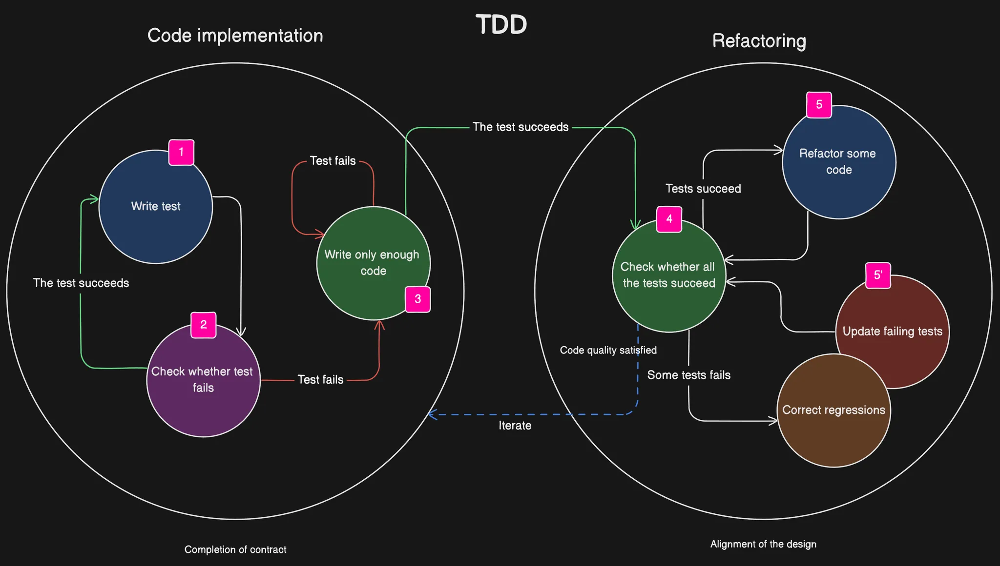
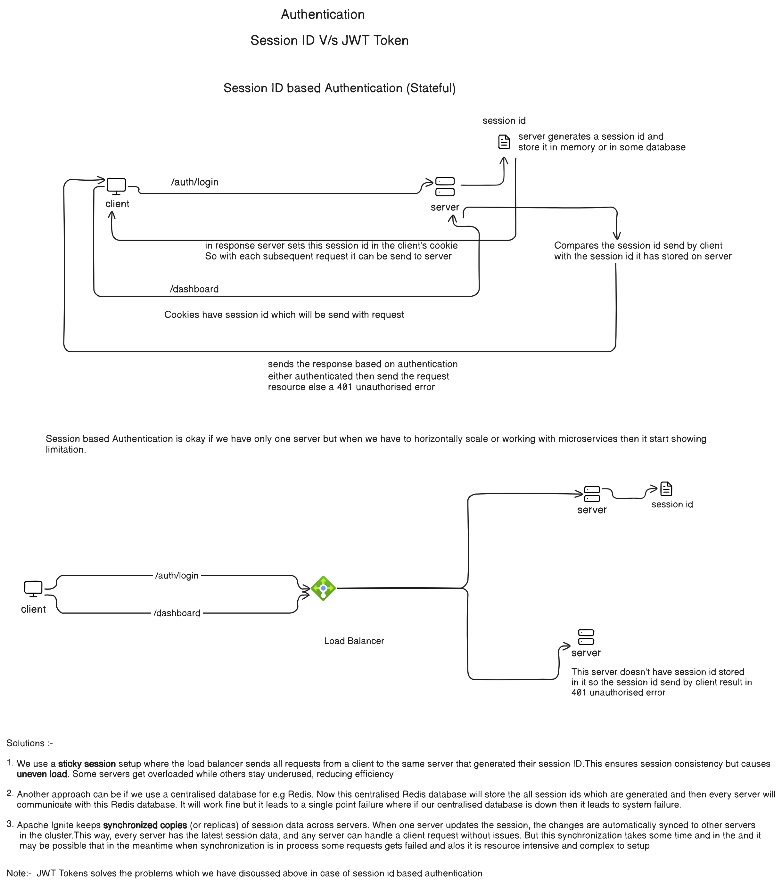
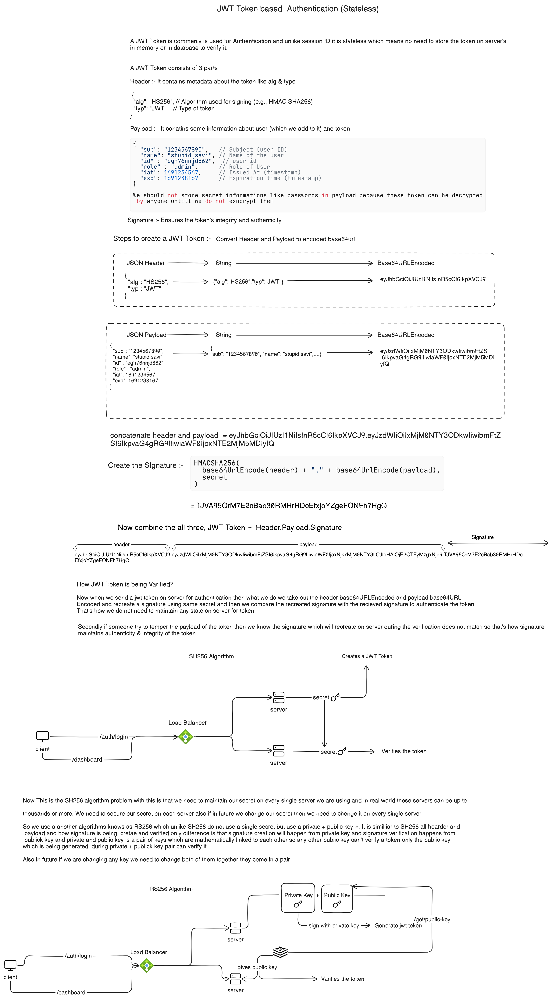

### Linting

eslint :- for eslint-ts configuration & rules :- `https://typescript-eslint.io, https://eslint.org/docs/latest/rules`

### Formatting

prettier :- `https://prettier.io/docs/en/install

### Git Hooks Automation

Git Hooks :- Husky and lint-staged :- `https://typicode.github.io/husky/get-started.html, https://github.com/lint-staged/lint-staged`

Husky allows us to register git hooks so we can automate linting and prettier commands for git actions like commit, push etc. and lint-staged only apply linting and formatting to changed files not the entire folder or files

### Logging

logger :- winston

### Testing

For jest testing - `pnpm add --save-dev jest, pnpm add --save-dev ts-jest, npx ts-jest config init, pnpm add --save-dev @types/jest, pnpm add --save-dev supertest @types/supertest `

### Test Driven Development (TDD)

Note:- In case of testing i.e jest it automatically set the NODE_ENV = test so no need to add cross-env NODE_ENV = test in its script

### Authenticatio

**Session ID based Authenticatio** :-

**JWT Token Based Authentication** :-

### Generate migration `pnpm run migration:generate src/migration/migration -d src/config/data-source.ts` or in some systems `npm run migration:generate -- src/migration/migration -d src/config/data-source.ts`

### Run the migration `pnpm run migration:run -d src/config/data-source.ts` or `npm run -- migration:run -d src/config/data-source.ts`

### Run the revert migration `pnpm run migration:revert -d src/config/data-source.ts` or `pnpm run migration:revert -- -d src/config/data-source.ts`

### Create a migration

**To hide password in USER entity we could have specified select : false in entity and wherever we need it in find query we could have user `findOne({select : ['password']})`**

**Instead of passing the entity of tenant in manager creation, we could have done `tenant : tenantId ? {id : tenantId} : undefined`**
